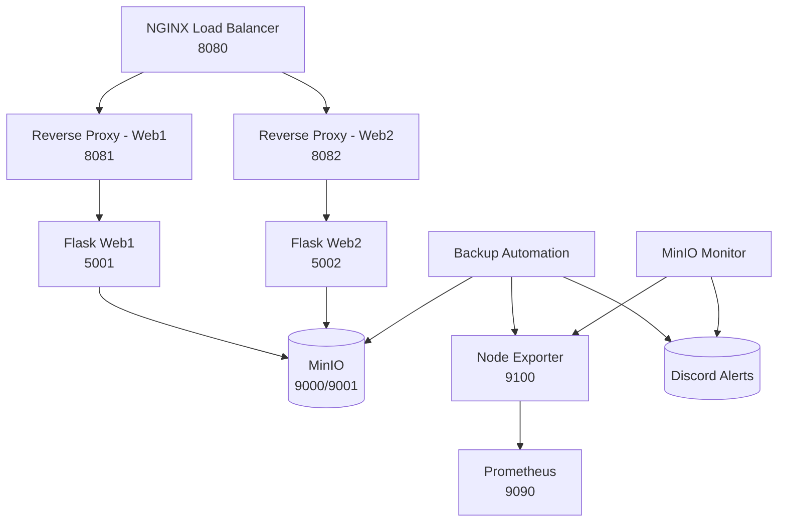

# 🌩️ **CloudOps Infrastructure Platform**

**A Production-Style Cloud Operations Project | Load Balancing • Reverse Proxies • Monitoring • Automation • Backups • MinIO • Prometheus**


---

# 📘 Table of Contents

* [Overview](#overview)
* [Core Architecture](#core-architecture)
* [Tech Stack](#tech-stack)
* [Features](#features)
* [Architecture Diagram](#architecture-diagram)
* [Service Breakdown](#service-breakdown)
* [Automation](#automation)
* [Monitoring & Observability](#monitoring--observability)
* [Security Enhancements](#security-enhancements)
* [Deployment Guide](#deployment-guide)
* [Repository Structure](#repository-structure)
* [What This Project Demonstrates](#what-this-project-demonstrates)
* [Future Enhancements](#future-enhancements)

---

# 🚀 Overview

This CloudOps Infrastructure project simulates a **real production environment**, including:

* Load balancer
* Reverse proxies
* Backend services
* Real automated backups with integrity checks
* MinIO S3 storage
* Prometheus monitoring
* Node Exporter metrics
* Real-time Discord alerting
* Cron automation
* Linux systemd service management
* Disaster-recovery tooling

This project demonstrates **DevOps, SRE, SysAdmin, and Cloud Engineering** skills.

---

# 🧱 Core Architecture

| Layer                 | Component                    | Description                           |
| --------------------- | ---------------------------- | ------------------------------------- |
| **Load Balancing**    | NGINX                        | Distributes traffic across Flask apps |
| **Reverse Proxies**   | NGINX proxies                | Incoming traffic isolation & routing  |
| **Application Layer** | Flask apps                   | Python backend services (systemd)     |
| **Object Storage**    | MinIO S3                     | Backup & file storage                 |
| **Monitoring**        | Prometheus + Node Exporter   | Metrics & alerts                      |
| **Automation**        | Bash + Cron + Discord Alerts | Backups, monitoring, cleanup          |

---

# 🛠️ Tech Stack

### **Infrastructure**

* Ubuntu Linux
* systemd services
* Bash automation scripts
* NGINX load balancer + reverse proxy
* MinIO S3 storage (Docker)

### **Monitoring & Alerts**

* Prometheus
* Node Exporter (textfile collector enabled)
* Custom Prometheus metrics
* Discord webhook alerts

### **Apps**

* Python Flask microservices
* Two independent backend apps
* Reverse-proxied with NGINX

---

# 💾 Features (Updated)

## ✔ **1. Automated Backup System**

Your backup automation now includes:

* Full backup of apps, configs, monitoring, and LB
* TAR archive creation
* SHA256 checksum generation
* Upload to MinIO
* Local vs remote **integrity verification**
* Automatic cleanup of temp directories
* Discord alerts:

  * ✔ Success
  * ❌ Failure (MinIO, TAR, missing files, etc.)

## ✔ **2. Backup Metrics (Prometheus)**

The system updates:

```
cloudops_last_backup_timestamp
cloudops_last_backup_size_bytes
cloudops_last_backup_integrity_ok
cloudops_minio_used_percent
```

These are available through Node Exporter → Prometheus.

---

# 📦 MinIO Storage Monitoring (New Today)

minio_monitor.sh:

* Computes MinIO disk usage %
* Sends Discord alerts if usage too high
* Writes metric → Prometheus textfile collector
* Cron-driven monitoring (every 6h)

---

# 🖼 Architecture Diagram (Textual)



---

# 🧩 Service Breakdown

## **1️⃣ NGINX Load Balancer**

* Round-robin
* Routes to reverse proxies

## **2️⃣ Reverse Proxies**

* Restricts methods
* Forwards to Flask apps
* Adds security layer

## **3️⃣ Flask Applications**

* User upload system
* Gallery
* Login system
* Health endpoints
* Runs under systemd

## **4️⃣ MinIO S3 Storage**

Buckets:

* `uploads`
* `backups`

Used for:

* App uploads
* Backup storage

## **5️⃣ Prometheus Monitoring Stack**

* Node Exporter metric collector
* Prometheus scraping custom metrics
* Dashboards ready for Grafana

---

# 🤖 Automation (Updated)

### **Backup Script**

* TAR + gzip
* SHA256 checksum
* Upload to MinIO
* Verify integrity
* Discord alert
* Prometheus metric update

### **MinIO Monitor Script**

* Checks used %
* Alerts if > threshold
* Updates Prometheus metric
* Cron-scheduled

### **Cleanup Script**

* Deletes old backups (> 30 days)

### **Restore Script**

* Pull backup from MinIO
* Extract
* Restore directories

---

# 📈 Monitoring & Observability (New Enhancements)

Node Exporter textfile collector enabled:

Custom metrics available at:

```
/var/lib/node_exporter/textfile_collector/cloudops.prom
```

Grafana-ready dashboards possible.

---

# 🔐 Security Enhancements

* Webhook secrets **NOT** stored in Git
* Sensitive scripts added to `.gitignore`
* Principle of least privilege (directories + services)
* NGINX method restrictions
* Local-only MinIO deployment
* systemd sandboxes services

---

# 🚀 Deployment Guide

### Clone repo:

```bash
git clone https://github.com/AshwinSajii/cloudops-infrastructure.git
cd cloudops-infrastructure
```

### Start core services:

```
sudo systemctl start web1 web2 nginx node_exporter prometheus
```

### Run backup manually:

```
~/cloudops/automation/backup.sh
```

### Monitor MinIO storage:

```
~/cloudops/automation/minio_monitor.sh
```

---

# 📂 Repository Structure (Updated)

```
cloudops/
│── automation/
│   ├── backup.sh
│   ├── minio_monitor.sh
│   ├── restore.sh
│   └── cleanup_backups.sh
│
│── apps/
│   ├── web1/
│   └── web2/
│
│── lb/
│── prometheus/
│── node_exporter/
│── backups/
│── logs/
│── docs/
│   └── cloudops-architecture.png
│
└── README.md
```

---

# 🏆 What This Project Demonstrates

### **Cloud Engineering**

* S3 storage
* Reverse proxies
* Load balancing
* Network routing

### **DevOps**

* Automation
* systemd services
* Infrastructure layout
* Observability stack

### **SRE**

* Backup + restore reliability
* Monitoring
* Alerting
* Integrity verification
* Disaster recovery

---

# 🚧 Future Enhancements

* Dockerize entire platform
* Kubernetes migration
* Add TLS (Certbot)
* CI/CD pipeline (GitHub Actions)
* Terraform IaC
* Grafana dashboards

---

# 👨‍💻 Author

**Ashwin Saji**
Cloud | DevOps | SRE Engineer


Just tell me!
